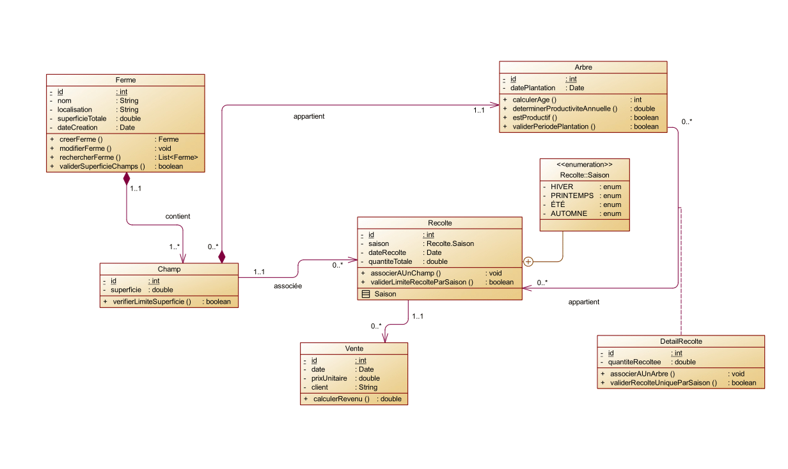

# Citronix - Application de Gestion pour une Ferme de Citrons

## Sommaire
1. **Présentation du Projet**
2. **Fonctionnalités Clés**
3. **Contraintes Métier et Techniques**
4. **Technologies Employées**
5. **Diagramme UML des Classes**
6. **Guide d'Installation**

---

## 1. Présentation du Projet
**Citronix** est une solution logicielle destinée aux agriculteurs pour gérer efficacement leurs activités liées à une ferme de citrons. Elle vise à simplifier le suivi de la production, de la récolte et des ventes, tout en optimisant les performances des arbres en fonction de leur cycle de vie. Ce projet offre un cadre structuré pour la gestion des ressources et des opérations agricoles.

---

## 2. Fonctionnalités Clés

### 2.1 Gestion des Fermes
- Ajout, modification et consultation des informations essentielles d'une ferme (nom, localisation, superficie, date de création).
- Mise en place d'une recherche avancée avec des critères multiples grâce au **Criteria Builder**.

### 2.2 Gestion des Champs
- Attribution de champs à une ferme avec une superficie clairement définie.
- Vérification automatique de la cohérence entre la superficie totale des champs et celle de la ferme.

### 2.3 Gestion des Arbres
- Suivi précis des arbres (date de plantation, âge, champ associé).
- Calcul automatique de l'âge et de la productivité saisonnière des arbres :
    - **Jeune** (< 3 ans) : 2,5 kg par saison.
    - **Mature** (3 à 10 ans) : 12 kg par saison.
    - **Vieux** (> 10 ans) : 20 kg par saison.

### 2.4 Gestion des Récoltes
- Gestion des récoltes saisonnières (hiver, printemps, été, automne).
- Limitation à une seule récolte par champ et par saison.
- Enregistrement des détails : date et quantité totale récoltée.

### 2.5 Détail des Récoltes
- Enregistrement des quantités récoltées pour chaque arbre.
- Association des récoltes individuelles à un arbre spécifique.

### 2.6 Gestion des Ventes
- Saisie des données de vente (date, prix unitaire, client, récolte liée).
- Calcul automatique des revenus : **Revenu = Quantité x Prix unitaire**.

---

## 3. Contraintes Métier et Techniques

### Contraintes Métier
- **Superficie minimale d’un champ** : 0.1 hectare (1 000 m²).
- **Superficie maximale d’un champ** : 50 % de la superficie de la ferme.
- **Nombre maximal de champs** : 10 par ferme.
- **Densité des arbres** : 100 arbres par hectare au maximum.
- **Période de plantation idéale** : Entre mars et mai.
- **Durée de vie des arbres** : Un arbre est considéré comme non productif au-delà de 20 ans.

### Contraintes Techniques
- Validation des données métier pour toutes les opérations CRUD.
- Gestion stricte des relations entre fermes, champs, arbres, et récoltes.
- Optimisation pour une utilisation intuitive et efficace.

---

## 4. Technologies Employées
- **Framework Backend** : Spring Boot pour la création d'API REST robustes.
- **Architecture Modulaire** : Organisation en couches (`Controller`, `Service`, `Repository`, `Entity`).
- **Simplification du code** : Utilisation de Lombok pour les entités et MapStruct pour la transformation des données.
- **Validation des données** : Avec les annotations de validation Spring.
- **Tests Unitaires** : JUnit et Mockito pour assurer la qualité du code.

---

## 5. Diagramme UML des Classes

Le diagramme ci-dessous représente les entités principales et leurs relations dans le projet Citronix.



Les classes principales comprennent :
- **Ferme (Farm)** : Représente une unité de gestion agricole.
- **Champ (Field)** : Associe une parcelle de terrain à une ferme.
- **Arbre (Tree)** : Suit les caractéristiques de chaque arbre.
- **Récolte (Harvest)** : Gère les données de production saisonnière.
- **Vente (Sale)** : Enregistre les transactions commerciales liées aux récoltes.

---

## 6. Guide d'Installation

### Prérequis
- **Java 17** ou une version plus récente.
- **Maven** : Pour la gestion des dépendances.
- **Postgres** : Base de données relationnelle pour stocker les informations.

### Étapes d'Installation
1. Clonez le dépôt du projet :
   ```bash
   git clone https://github.com/kholoud001/Citronix.git

